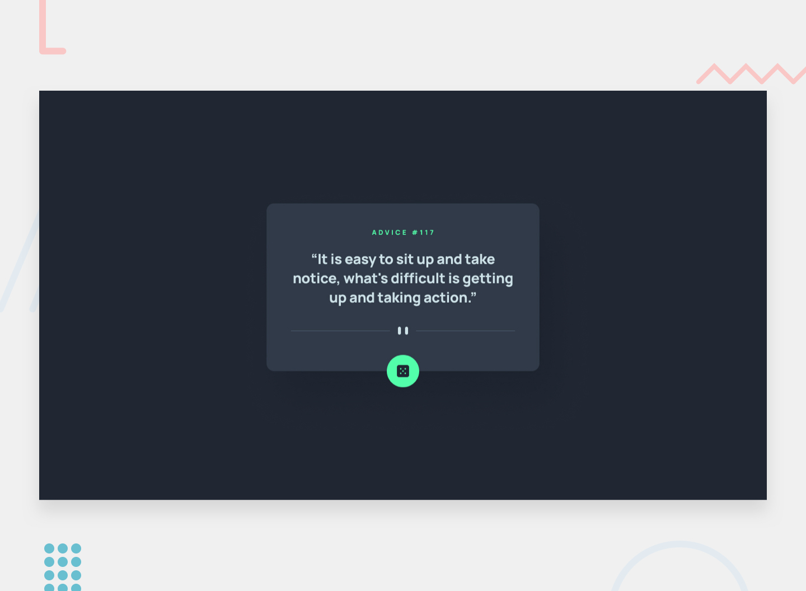

<h1 align="center">Frontend Mentor - Advice Generator App</h1>

This is my solution to the <b>Advice Generator App challenge on Frontend Mentor</b>.
Frontend Mentor challenges help developers improve their coding skills by building realistic projects.

<h2>Overview</h2>

<h3>The Challenge</h3>

Users should be able to:

<ul>
<li>View the optimal layout for the app depending on their device's screen size</li>
<li>See hover states for all interactive elements</li>
<li>Generate a new piece of advice by clicking the dice button</li>
<li>Fetch advice dynamically using an API</li>
</ul>

<h3>Screenshot</h3>

<h3>Links</h3>

<ul>
<li><b>Solution URL:</b> https://www.frontendmentor.io/solutions/your-solution-link</li>
<li><b>Live Site URL:</b> https://your-live-site-url.com</li>
</ul>

<h2>My Process</h2>

<h3>Built With</h3>

<ul>
<li>Semantic HTML5</li>
<li>CSS3</li>
<li>Flexbox</li>
<li>Responsive Design</li>
<li>JavaScript</li>
<li>Fetch API</li>
<li>Async / Await</li>
</ul>

<h3>What I Learned</h3>

While building this project, I learned how to work with APIs in JavaScript.
I used the Fetch API to request data and update the DOM dynamically.

This helped me understand:

<ul>
<li>How APIs return data</li>
<li>How JSON works</li>
<li>How to update the DOM dynamically</li>
</ul>

<h3>Continued Development</h3>

In future projects I want to focus more on:

<ul>
<li>Improving my JavaScript skills</li>
<li>Learning more about APIs</li>
<li>Writing cleaner and optimized code</li>
<li>Building more responsive UI designs</li>
</ul>

<h3>Useful Resources</h3>

<ul>
<li><a href="https://www.frontendmentor.io/">Frontend Mentor</a></li>
<li><a href="https://developer.mozilla.org/">MDN Web Docs</a></li>
</ul>

<h2>AI Collaboration</h2>

I used <b>ChatGPT</b> during this project to help with debugging JavaScript,
understanding the Fetch API, and improving the responsive layout.
It helped me learn faster while still writing and testing the code myself.

<h2>Author</h2>

<ul>
<li><b>Name:</b> Abdullah Zulfiqar</li>
<li><b>Frontend Mentor:</b> https://www.frontendmentor.io/profile/yourusername</li>
<li><b>GitHub:</b> https://github.com/yourusername</li>
</ul>

<h2>Acknowledgments</h2>

Thanks to <b>Frontend Mentor</b> for providing this challenge and helping developers practice real-world projects.

